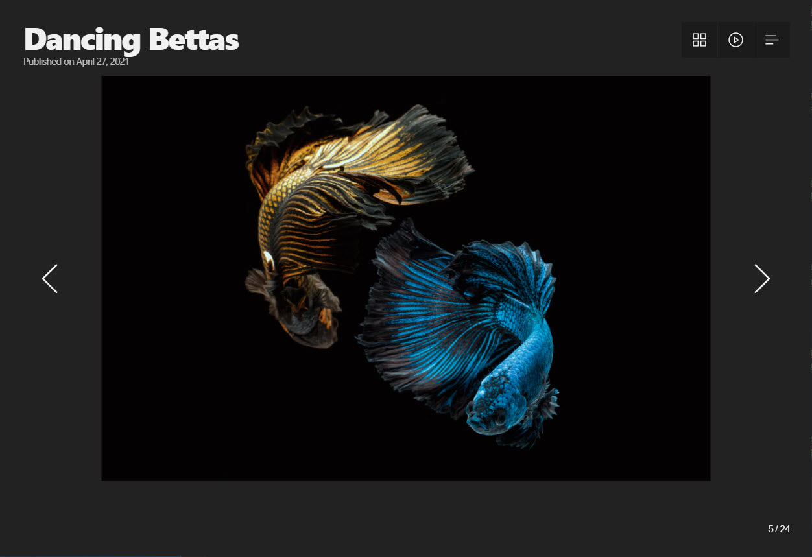

# Photoslide


The purpose of this app is to flip through photos one by one in the browser full screen.

Features:

- Settings for slide and image styles
- auto play
- Support for touch devices
- Multilingual
- Backup and restore slides and settings data
- Transition type setting
- Slide captions
- Dark mode
- Supports slide data in json format
- keyboard shortcuts

## Usage

Demo:

https://warrengalyen.github.io/photoslide/

After connecting, you can see the following screen.



This screen is composed of captions centered on the slide image, control buttons to move to previous|next, thumbnail list, and buttons to open the environment setting screen.

### Preference

Preferences allow you to directly adjust many of the features in your slideshow.  
You can open Preferences from `Menu > Preference` from the top right button . Each tab has a role and its description is as follows.

- General: Covers basic slideshow items.
- Slides: Items related to the slide function
- Style: Items related to image expression and color expression
- Data: Edit slide data
- Keyboard: Items related to keyboard shortcuts

### Manage slides data

Slide data can be edited in the 'Preference > Data' tab. If you open this example file [ example.json ](https://github.com/warrengalyen/photoslide/blob/master/src/example.json), you can see that the slide information is entered in an array. 
Here's what one slide looks like:

```json
{
  "src": "filename.jpg",
  "thumbnail": "filename.jpg",
  "title": "title text",
  "description": "description text"
}
```

The slide data is structured as follows.

-  `src` : slide image file address
-  `thumbnail` : Thumbnail image file address (not required. If this value does not exist, use it as `src` value.)
-  `title` : The title used in the caption
-  `description` : Description used in caption

Slide data can be imported by creating a `json` file or imported from an external server.


## Development Usage

Before building the development environment, clone the repository and install dependencies as follows.

```shell
git clone https://github.com/warrengalyen/photoslide.git
cd slideshow
yarn install
```

### Web environment

When developing a project, launch the development server by executing the following.

```shell
yarn run dev
```

If you open the server, you can preview by accessing  `http://localhost:3000` in your browser.
The main source of the project is in `src/` and the code is written in `vue3` .

When development is complete, build the project as follows.

```shell
yarn run build
```

When the build is complete, the files in the `docs/` path are updated.

### macOS and Windows app

Before building the app through Electron, first build the web project as follows.

```shell
yarn run build
```

You can run it in development mode or build it into production with the following command:

```shell
# development app
yarn run electron-dev
# build app
yarn run electron-build
```

### Using component

To use a slideshow in another project, you can directly add the component using `npm`.

```shell
yarn add @mechanika/slideshow
```

You can develop by adding dependencies and referring to the contents and sources of the 
[for external project](https://github.com/warrengalyen/photoslide/tree/master/src/external) directory.

## thanks

- vue3: https://v3.vuejs.org
- electron: https://www.electronjs.org
- example images: https://unsplash.com

<a href="https://www.flaticon.com/free-icon/slideshow_3650928?related_id=3650928" title="slideshow icons">App icon created by Smashicons - Flaticon</a>
